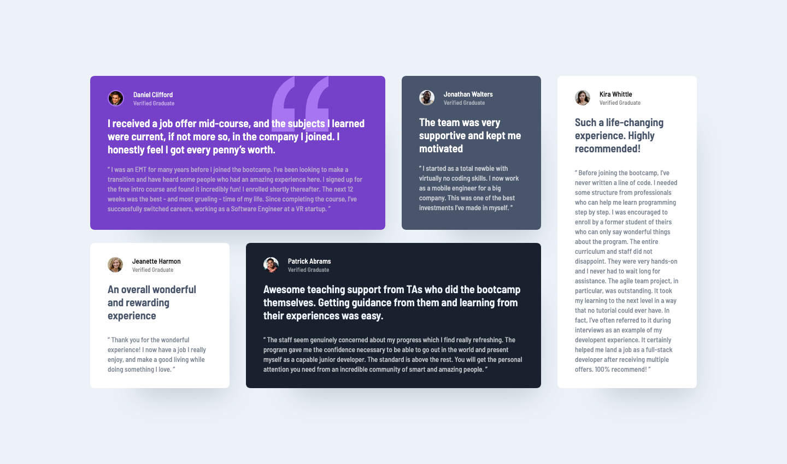

# Testimonials Grid Section

This is a solution to the [Testimonials grid section challenge on Frontend Mentor](https://www.frontendmentor.io/challenges/testimonials-grid-section-Nnw6J7Un7). Frontend Mentor challenges help you improve your coding skills by building realistic projects.

## About the Project

This project is a simple yet elegant display of testimonials arranged in a grid layout. Built using React, this project focuses on showcasing a responsive design with CSS and Scss, without any additional interactivity. It was an opportunity to practice creating structured, visually appealing layouts using React components.

## Preview and Links

<b>Open Preview</b>

 

 

| View it live: | [Live Demo URL](https://ionstici.github.io/testimonials-grid-section) | [Frontend Mentor](https://www.frontendmentor.io/solutions/testimonials-section-DTZ8Kz8fYt) |
| ------------- | --------------------------------------------------------------------- | ------------------------------------------------------------------------------------------ |

## Features

- **Grid Layout:** Testimonials are displayed in a responsive grid, adapting to different screen sizes.
- **Responsive Design:** Ensures the grid looks consistent and functional across all devices.

## Tech Stack

- **React:** For component-based development.
- **CSS/Scss**: For styling.

## Deployment

This project uses GitHub Pages for hosting.

## Acknowledgements

Thanks to **Frontend Mentor** for the challenge.
